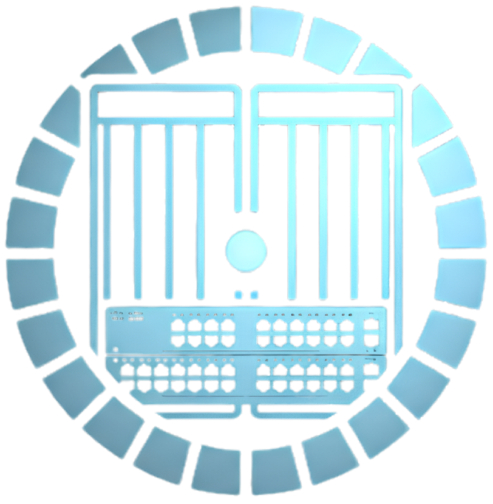
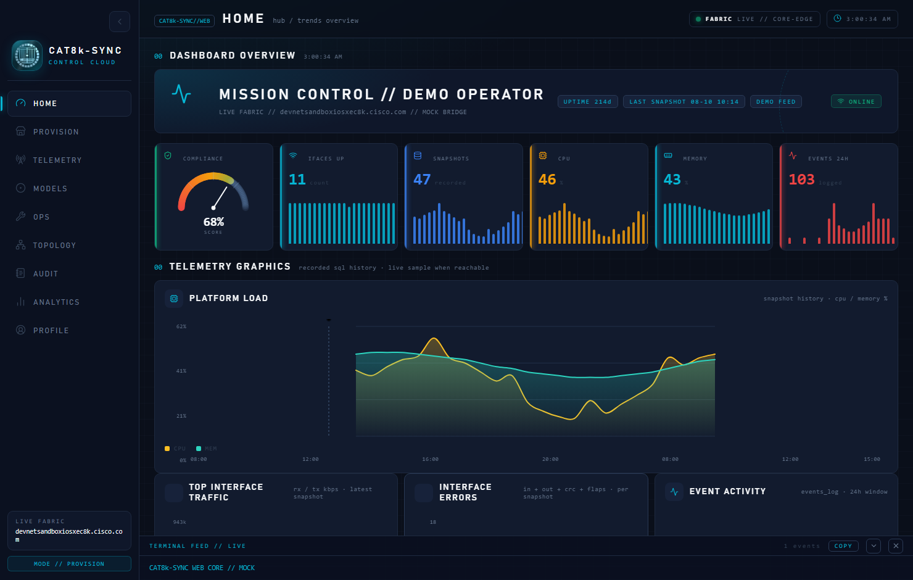
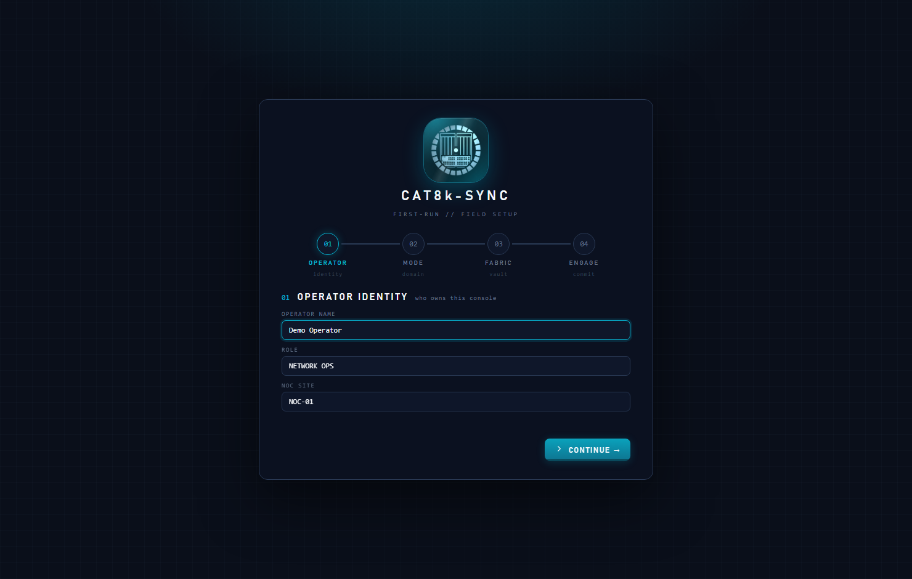
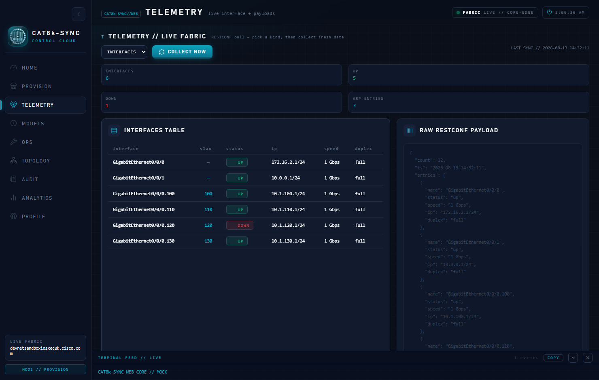
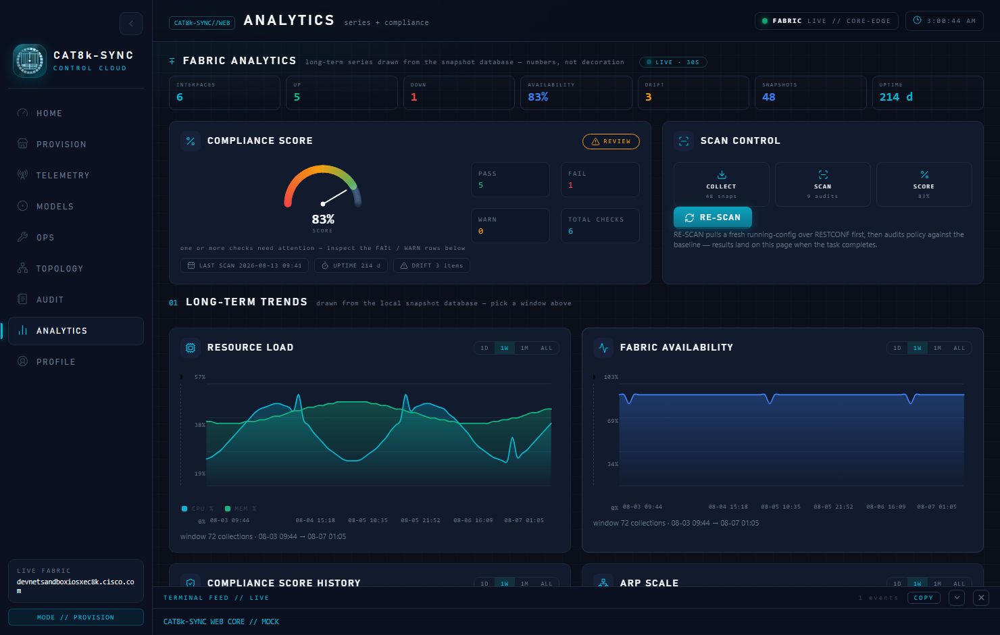
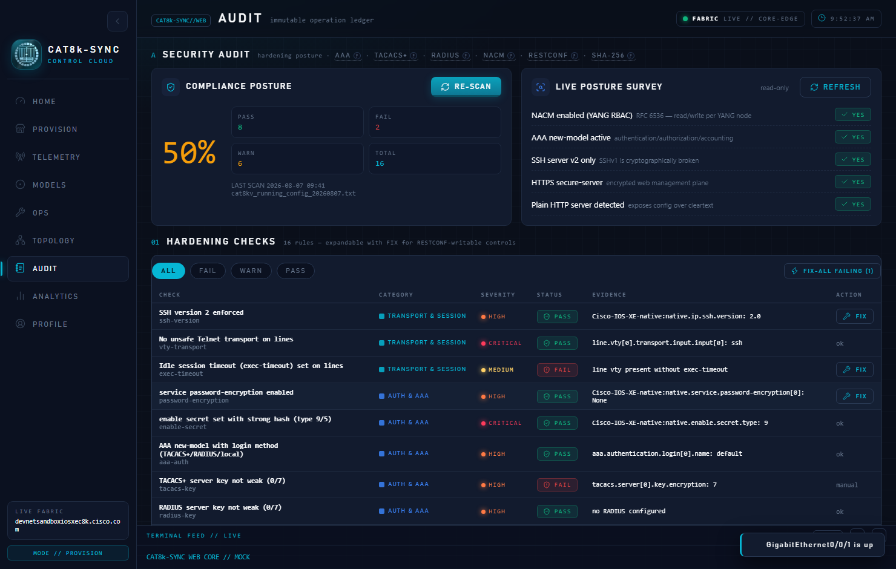
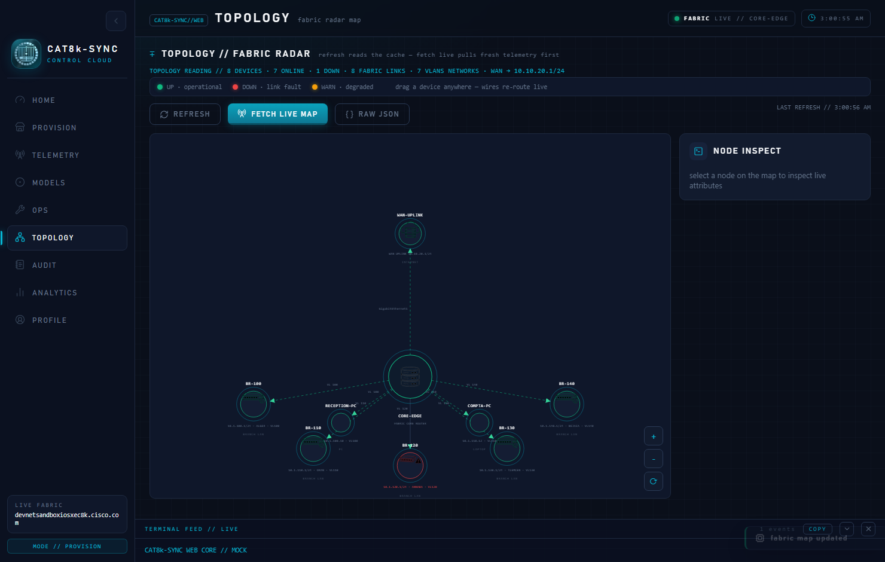
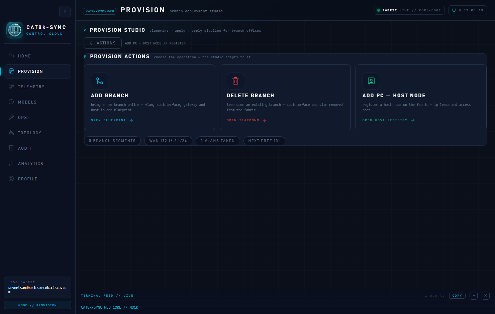
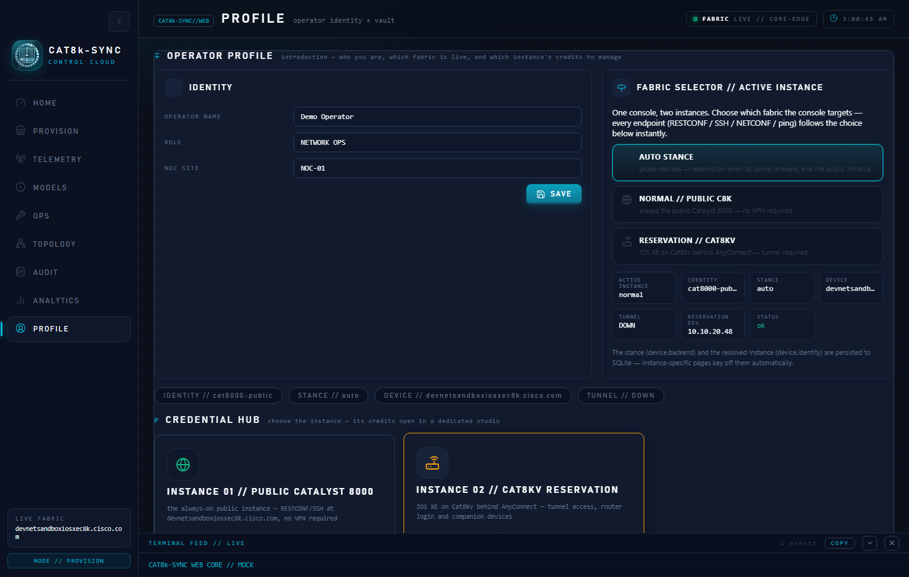

<p align="center">
  
</p>

<h1 align="center">CAT8k · SYNC</h1>

<p align="center">
  <b>One pane of glass for your Cisco Catalyst 8000v — telemetry, analytics, audit and provisioning, from a native desktop shell or a browser.</b>
</p>

<p align="center">
  <a href="#features"></a>
  <a href="#installation"></a>
  <a href="#usage"></a>
  <a href="#usage"></a>
  <a href="#ui"></a>
  <a href="#qa"></a>
</p>

<p align="center">
  <i>A final-year engineering project (PFA) — built to run against the Cisco DevNet Sandbox, at home, or on any reachable Catalyst 8000v.</i>
</p>

---

## Quick Start

> [!TIP]
> Everything you need is in `requirements.txt` — a standard virtual environment is enough.

```powershell
# Windows (PowerShell) — from inside the CAT8k-SYNC directory
python -m venv venv
venv\Scripts\python.exe -m pip install --upgrade pip
venv\Scripts\python.exe -m pip install -r requirements.txt
```

```bash
# macOS / Linux
python3 -m venv venv
source venv/bin/activate
pip install -r requirements.txt
```

### Launch

| Shell | Desktop app (customtkinter) | Web app (native window / browser) |
|---|---|---|
| Windows | `venv\Scripts\python.exe gui\app.py` | `venv\Scripts\python.exe gui\webapp.py` |
| macOS / Linux | `python gui/app.py` | `python gui/webapp.py` |

> [!NOTE]
> Launch the web app from the repository root — it serves the UI itself and prints the local URL on startup.

---

## Features

| | |
|---|---|
| **Telemetry collection** | Scheduled device snapshots with a 30-second live auto-collector — CPU, memory, interfaces, ARP and errors stream straight into a local time-series store. |
| **Analytics** | Multi-window charts (ALL / 1W / 1D) with live auto-refresh, KPI strip, and dense-window label management — no overlapping ticks, ever. |
| **Audit posture** | Config posture checks with severity scoring, a full change ledger, filters and gated fixes — all tracked, all undoable. |
| **Provisioning** | Jinja2 templates compiled into device configuration and deployed through the RESTCONF driver (HTTPS 443, primary) or CLI. |
| **Multi-transport** | RESTCONF first, with NETCONF exploration and SSH/CLI automation (Netmiko + Paramiko) as fallback and companion paths. |
| **Human-friendly CLI** | `show` command wrappers parsed through TextFSM into structured data for charts and reports. |
| **Credential vault** | Local, safe storage of device credentials — the vault never leaves the machine. |
| **Dual UI** | A native CustomTkinter desktop app *and* a web UI served locally, with identical features and a demo mode for click-through without hardware. |

---

## Screenshots

<table align="center">
  <tr>
    <td align="center"><br><sub>Home / hub</sub></td>
    <td align="center"><br><sub>Sign in</sub></td>
  </tr>
  <tr>
    <td align="center"><br><sub>Telemetry</sub></td>
    <td align="center"><br><sub>Analytics</sub></td>
  </tr>
  <tr>
    <td align="center"><br><sub>Audit posture</sub></td>
    <td align="center"><br><sub>Topology</sub></td>
  </tr>
  <tr>
    <td align="center"><br><sub>Provisioning</sub></td>
    <td align="center"><br><sub>Profile</sub></td>
  </tr>
</table>

> [!TIP]
> More captures live in `gui/web/screenshots/` — rail states, provisioning flows, deletion workflows and more.

---

## Installation

<details>
<summary><b>Step by step — Windows</b></summary>

```powershell
# 1. Create the virtual environment
python -m venv venv

# 2. Activate it
venv\Scripts\Activate.ps1

# 3. Upgrade pip, then install the pinned dependencies
venv\Scripts\python.exe -m pip install --upgrade pip
venv\Scripts\python.exe -m pip install -r requirements.txt
```

</details>

<details>
<summary><b>Step by step — macOS / Linux</b></summary>

```bash
# 1. Create the virtual environment
python3 -m venv venv

# 2. Activate it
source venv/bin/activate

# 3. Upgrade pip, then install the pinned dependencies
pip install --upgrade pip
pip install -r requirements.txt
```

</details>

**Dependencies** (`requirements.txt`):

| Package | Role |
|---|---|
| `netmiko` | SSH / CLI automation of network devices |
| `paramiko` | SSH transport under the hood |
| `pyyaml` | Configuration files & template context |
| `jinja2` | Configuration template engine |
| `textfsm` | Structured parsing of `show` output |
| `requests` | RESTCONF over HTTPS |
| `customtkinter` | Native desktop UI |

---

## Usage

### Desktop app

```powershell
venv\Scripts\python.exe gui\app.py
```

The desktop shell is the full management station: connect to a device, stream telemetry, run audit posture, generate and deploy configurations.

### Web app (native)

```powershell
venv\Scripts\python.exe gui\webapp.py
```

The same engine behind a web UI — it spawns its own local server and opens a native window (pywebview). From there you can also open it in any browser.

> [!TIP]
> Add `?demo=1` to the URL for a fully self-contained demo with a simulated device — no sandbox, no credentials, no hardware required.

### Device connectivity

- **RESTCONF over HTTPS (443)** — the primary path; TLS, YANG, JSON.
- **NETCONF explorer** — browse and inspect the device's capabilities.
- **SSH / CLI** — via Netmiko + Paramiko with TextFSM parsing for anything RESTCONF can't express.

---

## Repository Map

```
CAT8k-SYNC/
├── gui/
│   ├── app.py              # Desktop application entry point
│   ├── webapp.py           # Web server + native web window entry point
│   └── web/                # Web UI (JS/CSS), API bridge, screenshots, QA tooling
├── src/                    # Core engine
│   ├── connector.py        # Transport handling
│   ├── restconf_client.py  # RESTCONF client (HTTPS 443 — primary)
│   ├── netconf_explorer.py # NETCONF capability explorer
│   ├── cli_runner.py       # SSH / CLI automation (Netmiko)
│   ├── parser.py           # TextFSM show-output parsing
│   ├── generator.py        # Jinja2 configuration generation
│   ├── deployer.py         # RESTCONF provisioning driver
│   ├── automation.py       # Snapshot & telemetry collectors
│   ├── db.py               # Local embedded time-series store
│   ├── vault.py            # Credential vault
│   └── vpn.py              # Tunnel / transport helpers
├── config/                 # YAML config + Jinja2 templates
├── data/                   # Local databases
├── logs/  output/  screenshots/
├── requirements.txt
└── startup.txt
```

---

## QA

The web UI ships with a Playwright-based QA harness (`gui/web/tools/qa.py`) covering analytics live-refresh, audit, banners, chart-label collision checks and console-error hygiene — the same probes used to keep this project honest:

```powershell
venv\Scripts\python.exe gui\web\tools\qa.py
```

---

<p align="center">
  <sub><b>CAT8k · SYNC</b> — Catalyst 8000v, synced. Built with ❤︎, Python and too much coffee.</sub>
</p>
